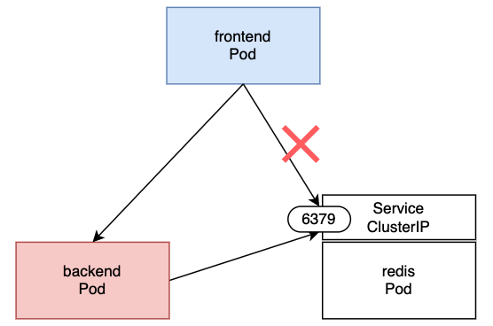

# セキュリティ RBAC、SecurityContext、NetWorkPolicy

## (前提事項) Kubectlコマンドの補完 & エイリアス
```sh
$ source <(kubectl completion bash)
$ echo "source <(kubectl completion bash)" >> ~/.bashrc
$ alias k=kubectl
$ complete -F __start_kubectl k
```

## (前提事項)kubernetes clusterの情報確認
worker nodeが1台以上あること

```sh
# control-plane, workerが各1台以上Readyで存在していること
$ k get nodes
NAME            STATUS   ROLES                  AGE   VERSION
master-node     Ready    control-plane,master   99m   v1.22.10
worker-node01   Ready    worker                 88m   v1.22.10
worker-node02   Ready    worker                 78m   v1.22.10
```

Docker + k3s環境でもChapterを実施できます。

||docs|概要|
|---|---|---|
|Docker + k3s|[k3s_in_doccker/doc.md](../k3s_in_doccker/doc.md)|k3sでcontrol plane×1 worker×2<br>|


<br><br>

## RBAC

### Nmespaceの作成

```sh
# 作成
$ k create namespace cap9
# 確認
k get namespaces cap9
NAME   STATUS   AGE
cap9   Active   16s
```

### Roleの作成
- 以下のRoleを作成し、applyする

```sh
# yamlの作成
# 以下のyaml定義をコピーしてyamlファイルを作成する
$ vi /tmp/cap9-role.yaml
$ k apply -f /tmp/cap9-role.yaml
```

```yaml
apiVersion: rbac.authorization.k8s.io/v1
kind: Role
metadata:
  name: cap9-pod-reader
  namespace: cap9
rules:
- apiGroups:
  - ""
  resources:
  - pods
  verbs:
  - get
  - list
  - watch
```

```sh
# 確認
# 利用できるVERBSやapiGroupsを確認する。v1は省略可能
$ k api-resources --namespaced=true --sort-by=name -o wide
NAME                        SHORTNAMES   APIVERSION                     NAMESPACED   KIND                       VERBS
・・・<省略>・・・
pods                        po           v1                             true         Pod                        [create delete deletecollection get list patch update watch]
pods                                     metrics.k8s.io/v1beta1         true         PodMetrics                 [get list]

・・・<省略>・・・

$ k get role -n cap9
NAME              CREATED AT
cap9-pod-reader   2022-09-06T06:26:50Z

$ k describe role cap9-pod-reader -n cap9
Name:         cap9-pod-reader
Labels:       <none>
Annotations:  <none>
PolicyRule:
  Resources  Non-Resource URLs  Resource Names  Verbs
  ---------  -----------------  --------------  -----
  pods       []                 []              [get list watch]
```

### ServiceAccountの作成
- 以下のServiceAccountを作成し、applyする

```sh
# yamlの作成
# 以下のyaml定義をコピーしてyamlファイルを作成する
$ vi /tmp/cap9-sa.yaml
$ k apply -f /tmp/cap9-sa.yaml
```

```yaml
apiVersion: v1
kind: ServiceAccount
metadata:
  name: cap9-service-account
  namespace: cap9
```

```sh
# 確認
$ k get sa -n cap9
NAME                   SECRETS   AGE
default                1         9m10s
cap9-service-account   1         83s

# 詳細確認
$ k describe sa -n cap9
```

### RoleBindingの作成
- 以下のRoleBindingを作成し、applyする

```sh
# yamlの作成
# 以下のyaml定義をコピーしてyamlファイルを作成する
$ vi /tmp/cap9-rolebinding.yaml
$ k apply -f /tmp/cap9-rolebinding.yaml
```

```yaml
apiVersion: rbac.authorization.k8s.io/v1
kind: RoleBinding
metadata:
  name: cap9-pod-reader-bind
  namespace: cap9
roleRef:
  apiGroup: rbac.authorization.k8s.io
  kind: Role
  name: cap9-pod-reader
subjects:
- kind: ServiceAccount
  name: cap9-service-account
  namespace: cap9
```

```sh
# 確認
$ k get rolebinding -n cap9
NAME                   ROLE                   AGE
cap9-pod-reader-bind   Role/cap9-pod-reader   10s

# 詳細確認
$ k describe rolebinding cap9-pod-reader-bind -n cap9
Name:         cap9-pod-reader-bind
Labels:       <none>
Annotations:  <none>
Role:
  Kind:  Role
  Name:  cap9-pod-reader
Subjects:
  Kind            Name                  Namespace
  ----            ----                  ---------
  ServiceAccount  cap9-service-account  cap9
```

### PodからServiceAccountの利用
- 以下のRodを作成し、applyする

```sh
# yamlの作成
# 以下のyaml定義をコピーしてyamlファイルを作成する
$ vi /tmp/cap9-sa-pod.yaml
$ k apply -f /tmp/cap9-sa-pod.yaml
```

```yaml
apiVersion: v1
kind: Pod
metadata:
  labels:
    run: cap9-sa-test
  name: cap9-sa-test
  namespace: cap9
spec:
  serviceAccountName: cap9-service-account
  containers:
  - image: bitnami/kubectl:1.22.10
    name: cap9-sa-test
    command:
    - sh
    - -c
    - |
      while true
      do
        sleep 30
      done
```

```sh
# 確認
$ k get pod -n cap9
NAME           READY   STATUS    RESTARTS   AGE
cap9-sa-test   1/1     Running   0          17s

# 詳細確認
# ServiceAccountのトークン情報がVolumeでcontainerにマウントされている
$ k get pod -n cap9 -o yaml
・・・<省略>・・・
  spec:
    containers:
    - image: nginx:alpine
      imagePullPolicy: IfNotPresent
      name: cap9-sa-test
      resources: {}
      terminationMessagePath: /dev/termination-log
      terminationMessagePolicy: File
      volumeMounts:
      - mountPath: /var/run/secrets/kubernetes.io/serviceaccount
        name: kube-api-access-27frf
        readOnly: true
・・・<省略>・・・
    volumes:
    - name: kube-api-access-27frf
      projected:
        defaultMode: 420
        sources:
        - serviceAccountToken:
            expirationSeconds: 3607
            path: token
・・・<省略>・・・
```

#### Podないからk8sのAPIにアクセスする
```sh
# container上でshを起動
$ k exec -it cap9-sa-test -n cap9 sh
# 以下container内

# トークン確認
$ ls /var/run/secrets/kubernetes.io/serviceaccount
ca.crt     namespace  token

# APIにアクセス
# Pod Resourcesにアクセス可能
$ kubectl get pods -o wide
NAME           READY   STATUS    RESTARTS   AGE   IP           NODE          NOMINATED NODE   READINESS GATES
cap9-sa-test   1/1     Running   0          16m   10.42.0.10   k3s-worker2   <none>           <none>

# 他のResourcesにアクセスできない
$ kubectl get deploy
Error from server (Forbidden): deployments.apps is forbidden: User "system:serviceaccount:cap9:cap9-service-account" cannot list resource "deployments" in API group "apps" in the namespace "cap9"

# 別のNamespaceにアクセスできない
$ kubectl get pods -o wide -n default
Error from server (Forbidden): pods is forbidden: User "system:serviceaccount:cap9:cap9-service-account" cannot list resource "pods" in API group "" in the namespace "default"

# 直接token,ca.crtを利用してhttpsベースでアクセス
# 環境変数をセットする ※直接指定でもOK
# Point to the internal API server hostname
$ APISERVER=https://kubernetes.default.svc

# Path to ServiceAccount token
$ SERVICEACCOUNT=/var/run/secrets/kubernetes.io/serviceaccount

# Read this Pod's namespace
$ NAMESPACE=$(cat ${SERVICEACCOUNT}/namespace)

# Read the ServiceAccount bearer token
$ TOKEN=$(cat ${SERVICEACCOUNT}/token)

# Reference the internal certificate authority (CA)
$ CACERT=${SERVICEACCOUNT}/ca.crt

# アクセス
$ curl --cacert ${CACERT} --header "Authorization: Bearer ${TOKEN}" -X GET ${APISERVER}/api

$ curl --cacert ${CACERT} --header "Authorization: Bearer ${TOKEN}" -X GET ${APISERVER}/api/v1/namespaces/${NAMESPACE}/pods| jq -r '.items[0].metadata.name, .items[0].status.phase'
```

## SecurityContext

### UserとGroup
- 以下のPodを作成し、applyする

```sh
# yamlの作成
# 以下のyaml定義をコピーしてyamlファイルを作成する
$ vi /tmp/cap9-user.yaml
$ k apply -f /tmp/cap9-user.yaml
```

```yaml
apiVersion: v1
kind: Pod
metadata:
  labels:
    run: cap9-user
  name: cap9-user
spec:
  containers:
  - image: alpine
    name: cap9-user
    command:
    - sh
    - -c
    - |
      while true
      do
        sleep 30
      done
```

```sh
# 確認
$ k get pod cap9-user

# containerでshellを実行
$ k exec -it cap9-user -- sh
# 以下container内

# rootで実行されている
id
uid=0(root) gid=0(root) groups=1(bin),2(daemon),3(sys),4(adm),6(disk),10(wheel),11(floppy),20(dialout),26(tape),27(video)

# ファイルも当然rootで作成される
touch /tmp/testfile
ls -l /tmp/testfile
-rw-r--r--    1 root     root             0 Sep  6 10:11 /tmp/testfile

# shell終了
exit
```

- 以下のPodを作成し、applyする

```sh
# yamlの作成
# 以下のyaml定義をコピーしてyamlファイルを作成する
$ vi /tmp/cap9-sec-user.yaml
$ k apply -f /tmp/cap9-sec-user.yaml
```

```yaml
apiVersion: v1
kind: Pod
metadata:
  labels:
    run: cap9-sec-user
  name: cap9-sec-user
spec:
  containers:
  - image: alpine
    name: cap9-sec-user
    command:
    - sh
    - -c
    - |
      while true
      do
        sleep 30
      done
    securityContext:
      runAsUser: 1000
      runAsGroup: 3000
```

```sh
# 確認
$ k get pod cap9-sec-user

# containerでshellを実行
$ k exec -it cap9-sec-user -- sh
# 以下container内

# 設定したUser/Gropuで実行されている
id
uid=1000 gid=3000

# 設定したUser/Gropuで作成される
touch /tmp/testfile
ls -l /tmp/testfile
-rw-r--r--    1 1000     3000             0 Sep  6 10:15 /tmp/testfile

# shell終了
exit
```

!! 個人的にはContainer Imagesの時点(例：Dockerfileの時点)でUser(Gropu)を予め指定しておいたほうが良いと考える。<br>
その場合、SecurityContextの指定をしなくてもrootで実行されない<br>


### Rootの実行の制限
- 以下のPodを作成し、applyする

```sh
# yamlの作成
# 以下のyaml定義をコピーしてyamlファイルを作成する
$ vi /tmp/cap9-nonroot.yaml
$ k apply -f /tmp/cap9-nonroot.yaml
```

```yaml
apiVersion: v1
kind: Pod
metadata:
  labels:
    run: cap9-nonroot
  name: cap9-nonroot
spec:
  containers:
  - image: alpine
    name: cap9-nonroot
    command:
    - sh
    - -c
    - |
      while true
      do
        sleep 30
      done
    securityContext:
      runAsNonRoot: true
```

```sh
# 確認
# 実行できない
$ k get pod cap9-nonroot
NAME           READY   STATUS                       RESTARTS   AGE
cap9-nonroot   0/1     CreateContainerConfigError   0          14s

# 詳細
# rootの実行エラーが出ている
$ k describe pod cap9-nonroot
・・・<省略>・・・
Events:
  Type     Reason     Age               From               Message
  ----     ------     ----              ----               -------
・・・<省略>・・・
  Warning  Failed     5s (x4 over 38s)  kubelet            Error: container has runAsNonRoot and image will run as root (pod: "cap9-nonroot_default(72aff5e2-d890-47fa-9754-a63913207627)", container: cap9-nonroot)

# 削除
$ k delete -f /tmp/cap9-nonroot.yaml
```

- 以下yamlを修正し、applyする

```sh
# yamlの修正
# 以下のyaml定義をコピーしてyamlファイルを作成する
$ vi /tmp/cap9-nonroot.yaml
$ k apply -f /tmp/cap9-nonroot.yaml
```

```yaml
apiVersion: v1
kind: Pod
metadata:
  labels:
    run: cap9-nonroot
  name: cap9-nonroot
spec:
  containers:
  - image: alpine
    name: cap9-nonroot
    command:
    - sh
    - -c
    - |
      while true
      do
        sleep 30
      done
    securityContext:
      runAsNonRoot: true
      runAsUser: 1000
      runAsGroup: 3000
```

```sh
# 確認
# 実行される
$ k get pod cap9-nonroot
NAME           READY   STATUS    RESTARTS   AGE

# 実行ユーザ
$ k exec cap9-nonroot -- id
uid=1000 gid=3000
```


## NetworkPolicy
### イメージ図
- redisに対してfrontendのPodからのアクセスを拒否する




### 各Pod、Serviceの作成
- 以下コマンドを実行する
```sh
$ k apply -f https://raw.githubusercontent.com/n-guitar/k8s-bootcamp/main/chapter9/networkpolicy_sample.yaml
```

- 確認

NodePortでWebBrowserでアクセスし、各サービスにアクセスしてみる。

```sh
$ k get pod -l 'run in (frontend,backend,redis)'
NAME       READY   STATUS    RESTARTS   AGE
redis      1/1     Running   0          9m54s
backend    1/1     Running   0          9m55s
frontend   1/1     Running   0          9m55s

$ k get svc -l 'app in (frontend-service,backend-service,redis-service)'
NAME               TYPE        CLUSTER-IP      EXTERNAL-IP   PORT(S)          AGE
frontend-service   NodePort    10.43.86.190    <none>        8080:30005/TCP   10m
backend-service    NodePort    10.43.57.134    <none>        8080:30000/TCP   10m
redis              ClusterIP   10.43.253.120   <none>        6379/TCP         10m
```

### NetworkPolicyの作成

```yaml
apiVersion: networking.k8s.io/v1
kind: NetworkPolicy
metadata:
  name: network-policy-test
spec:
  podSelector:
    matchLabels:
      run: redis
  policyTypes:
  - Ingress
  ingress:
  - from:
    - podSelector:
        matchLabels:
          run: backend
    ports:
    - protocol: TCP
      port: 6379
```

NodePortでWebBrowserでアクセスし、各サービスにアクセスしてみる。


## 練習問題

### ex1
- 以下の条件で各Resourcesを作成せよ

```sh
# Namespace
cap9ex

# ServiceAccount
Name：cap9ex-sa
Namespace：cap9ex

# Role
Name：cap9ex-role
Namespace：cap9ex
権限：※Deploymentの作成・削除・確認ができる権限をつけよ

# RoleBinding
Name：cap9ex-rolebindings
Namespace：cap9ex
Bind：cap9ex-sa
```

### ex2
- 以下のyaml編集し、ex1で作成したServiceAccountを利用して、Pod内からkubectlでDeployment作成できるPodを作成せよ。
- また、以下の条件でPod内からkubectlでDeployment作成せよ

```yaml
apiVersion: v1
kind: Pod
metadata:
  labels:
    run: cap9-ex2
  name: cap9-ex2
  namespace: cap9
spec:
  containers:
  - image: bitnami/kubectl:1.22.10
    name: cap9-ex2
    command:
    - sh
    - -c
    - |
      while true
      do
        sleep 30
      done
```

```
Name: cap9-ex2-pod
Images: nginx:alpine
Replica：1
```

### ex3
- Pod内からkubectl get nodesができるPodを作成せよ
- ※ClusterRole,ClusterRoleBindingを利用すること


### ex4
- 以下のyaml編集し、userid=2001,groupid=3001でPodを実行せよ

```yaml
apiVersion: v1
kind: Pod
metadata:
  labels:
    run: cap9-ex4
  name: cap9-ex4
spec:
  containers:
  - image: alpine
    name: cap9-ex4
    command:
    - sh
    - -c
    - |
      while true
      do
        sleep 30
      done
```
